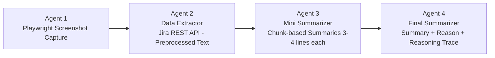

# Jira Issue Summarizer

A multi-agent system built with **LangGraph** that automatically fetches, processes, and summarizes Jira issues using LLM-powered agents. Includes a Streamlit UI, Playwright-based screenshot capture, and built-in evaluation metrics (RAGAS faithfulness, causal coherence).

---

## Architecture

The pipeline runs four agents in sequence via a LangGraph `StateGraph`:

## 🧠 Architecture Pipeline



| Agent | Role |
|-------|------|
| **Agent 1** — Playwright | Captures a full-page screenshot of the Jira ticket in a headless browser |
| **Agent 2** — Data Extractor | Fetches issue details (title, description, comments, attachments) via Jira REST API v3 and normalizes them into clean text |
| **Agent 3** — Mini Summarizer | Splits the normalized text into word-based chunks and generates a concise 3–4 line summary per chunk |
| **Agent 4** — Final Summarizer | Merges mini-summaries into a final output with three sections: **Summary**, **Reason Not Processed**, and **Trace** |

### Evaluation

After summarization, two evaluation functions run automatically:

- **Faithfulness** (RAGAS) — measures how accurately the summary and reasoning trace reflect the source Jira data
- **Causal Coherence** — LLM-as-judge scoring (1–5) to verify the reasoning trace logically leads to the conclusions

Metrics displayed in the Streamlit sidebar include: response faithfulness, trace faithfulness, trace recall, trace precision, F1 score, and causal coherence.

---

## Tech Stack

- **LangGraph** — agent orchestration and state management
- **Groq** (LLaMA 3.3 70B) — LLM inference
- **RAGAS** — evaluation framework (faithfulness, context recall/precision)
- **Playwright** — headless browser automation for screenshots
- **Streamlit** — interactive web UI
- **Jira REST API v3** — issue data extraction

---

## Project Structure

```
├── final_langgraph_agents.py   # Main 4-agent LangGraph pipeline + evaluation
├── playwright_agents.py        # Playwright screenshot capture utility
├── updated_streamlit.py        # Streamlit UI for the pipeline
├── test_agents.py              # Pytest unit tests
├── ingest_data.py              # Standalone Jira data ingestion utility
├── jira_retrieval.py           # FAISS-based RAG retrieval over Jira chunks
├── requirements.txt            # Python dependencies
└── .env.example                # Required environment variables template
```

---

## Setup

### 1. Clone the repository

```bash
git clone https://github.com/<your-username>/jira-issue-summarizer.git
cd jira-issue-summarizer
```

### 2. Create a virtual environment

```bash
python -m venv .venv
# Windows
.venv\Scripts\activate
# macOS/Linux
source .venv/bin/activate
```

### 3. Install dependencies

```bash
pip install -r requirements.txt
playwright install chromium
```

### 4. Configure environment variables

Copy `.env.example` to `.env` and fill in your credentials:

```bash
cp .env.example .env
```

| Variable | Description |
|----------|-------------|
| `JIRA_BASE_URL` | Your Atlassian instance URL (e.g. `https://yourorg.atlassian.net`) |
| `jira_email` | Jira account email |
| `jira_api_key` | Jira API token ([generate here](https://id.atlassian.com/manage-profile/security/api-tokens)) |
| `GROQ_API_KEY` | Groq API key ([get one](https://console.groq.com/keys)) |
| `GROQ_MODEL` | Model name (default: `llama-3.3-70b-versatile`) |

### 5. Generate Playwright auth state (one-time)

Run the login helper to save your Jira session cookies:

```bash
python playwright_agents.py
```

> On first run, launch with `headless=False` in the script, log in manually, then save the storage state. See the commented-out section at the bottom of `playwright_agents.py`.

---

## Usage

### Streamlit UI

```bash
streamlit run updated_streamlit.py
```

Enter a Jira issue key (e.g. `SCRUM-2`) and click **Inspect Issue**. The app will:

1. Capture a screenshot of the ticket
2. Display extracted issue data (JSON)
3. Show intermediate mini-summaries
4. Present the final summary with reasoning trace
5. Run evaluation metrics in the sidebar

### CLI

```bash
python final_langgraph_agents.py
```

Enter an issue key when prompted. The pipeline runs all four agents and prints the final summary, context-window reduction stats, and evaluation scores.

---

## Evaluation Metrics

| Metric | What it measures |
|--------|------------------|
| **Response Faithfulness** | Groundedness of the final summary in the Jira data |
| **Trace Faithfulness** | How well the reasoning trace is grounded in source data |
| **Trace Recall** | Completeness — how much relevant info the trace captured |
| **Trace Precision** | Purity — how much of the trace is relevant and non-hallucinated |
| **Trace F1** | Harmonic mean of trace precision and recall |
| **Causal Coherence** | Whether reasoning steps logically lead to the conclusions (1–5) |

---

## Testing

```bash
pytest test_agents.py -v
```

Tests cover agent1 (Playwright), agent2 (Jira fetch), and agent3 (LLM summarization) with monkeypatched dependencies.

---

